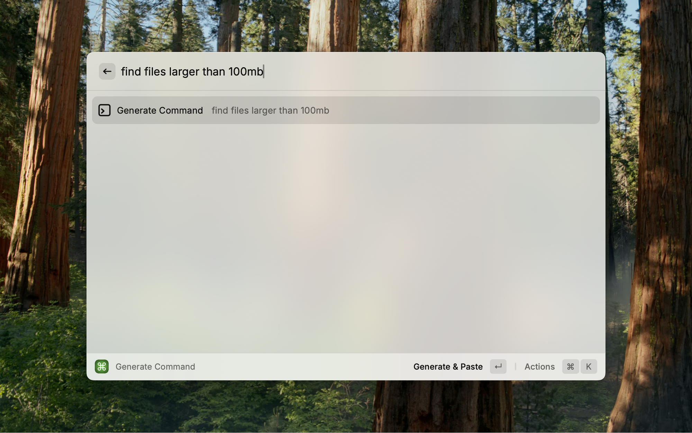
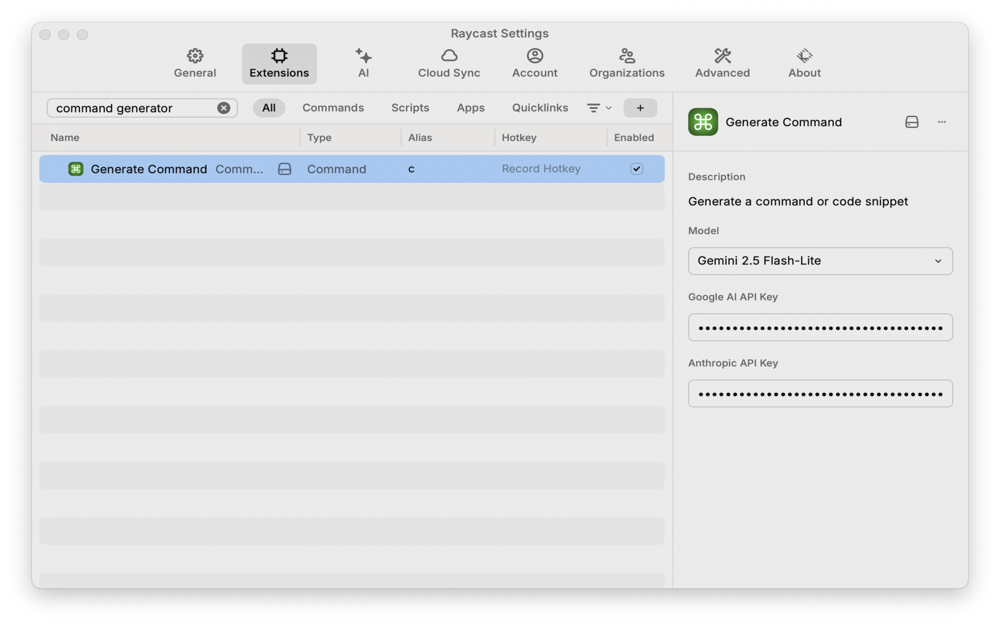
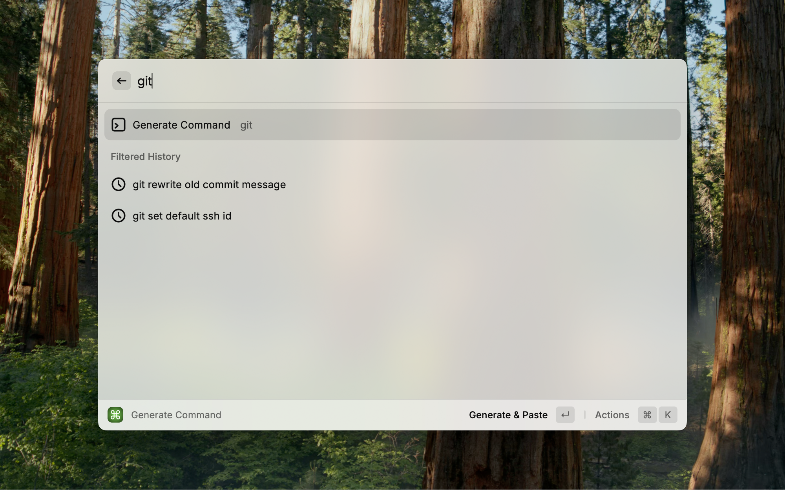
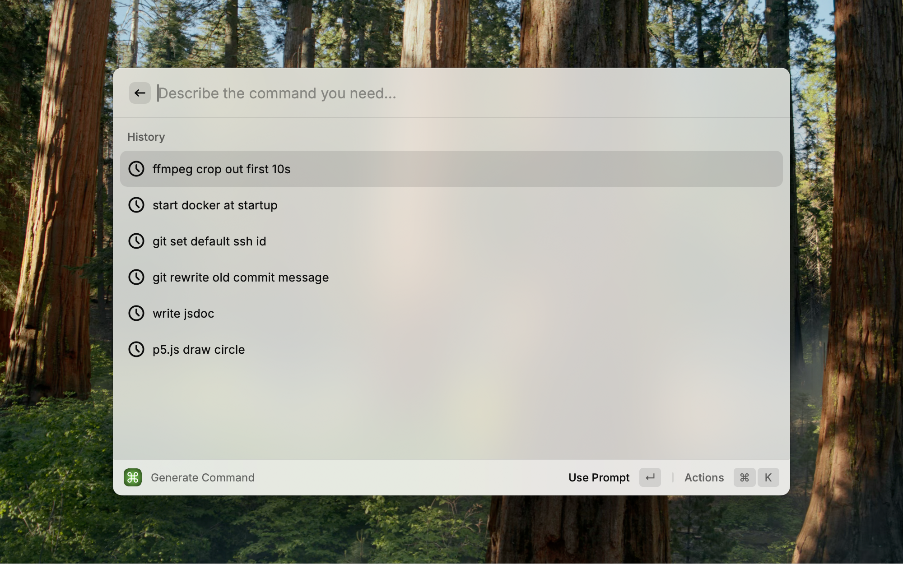

# Command Generator
A Raycast extension that generates CLI commands and code snippets from natural language. Inspired by Cursor's Cmd+K.



Output:
```
find . -type f -size +100M
```

### Features
- **Natural language to CLI**: Describe what you want to do, get a ready-to-run command
- **Auto-paste**: Generated command is pasted directly into active window, or can be copied to clipboard
- **Context-aware**: Picks up selected text, current app, and directory to improve suggestions
- **History**: Prompt history with filtering
- **Model choice**: Gemini 2.5 Flash-Lite (recommended) or Claude Haiku 4.5

## Installation
1. Clone this repo
2. `npm run build`

## Configuration
Open Raycast Settings > Extensions > Command Generator:

- **Model**: Choose between Gemini 2.5 Flash-Lite (recommended) or Claude Haiku 4.5
- **Google AI API Key**: Required for Gemini (https://aistudio.google.com/apikey)
- **Anthropic API Key**: Required for Haiku (https://console.anthropic.com/settings/keys)



## Usage
1. Run "Generate Command" from Raycast (alias for quick access)
2. Type what you want to do (e.g., "find large files over 100MB")
3. Press **Enter** to generate and paste the command
4. Press **Cmd+Shift+C** to copy instead of paste

### History


- When search is empty, history is shown
- Type to filter history
- Select a history item to edit it before regenerating

### Context
The extension automatically captures:
- **Selected text** from the previous app (useful for error messages)
- **Current app** (only dev tools: Terminal, VS Code, etc.)
- **Current directory** (from Terminal/iTerm)

Context is only included when relevant to avoid confusing the model.

### Examples

```
ffmpeg -i input.mp4 -ss 00:00:00 -to 00:00:10 -c copy output.mp4
```

```
sudo systemctl enable docker
```

```
ssh-add -D && ssh-add ~/.ssh/id_rsa
```

```
git commit --amend -m "New commit message"
```

```
/**
 * Calls the AI model based on user preferences.
 *
 * @param {Preferences} preferences - User preferences, including model and API keys.
 * @param {string} prompt - The prompt to send to the AI model.
 * @returns {Promise<string>} The AI model's response.
 * @throws {Error} If the required API key is missing for the selected model.
 */
```

```
function setup() {
  createCanvas(400, 400);
}
function draw() {
  background(220);
  circle(200, 200, 100);
}
```

## Development
`npm run dev`
